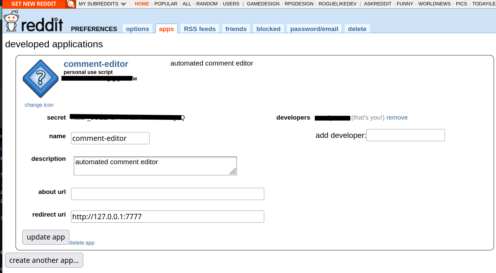

# Reddit Bot Starter

Requirements:
- Python 3.7+
- Reddit Account
- Determination

Tired of using Reddit manually (or in general)?

I am.

You can use this bot starter as a jumpstart for making your own app for automatically managing your Reddit account.

# Set up your bot credentials.

Go to your reddit account settings

Create your app
- preferences
- apps
- create apps
- click script
- for redirect_url: enter something like: http://127.0.0.1:7777

Get your app credentials
- the sequence of characters under personal use token is your `client_id`
- the secret is your `client_secret`
- your `user_agent` is your `<your app name> by /u/your_user_name`

Put those credentials into your `praw_example.ini` and copy that file to `praw.ini`.

# Install required libraries

Library | Command | Description
---|---|---
praw | `pip install praw` | python reddit api wrapper
requests | `pip install requests` | make network requests

Run: `$ python main.py` or `$ python3 main.py`

--- 

LICENSE
MIT/Apache2.0